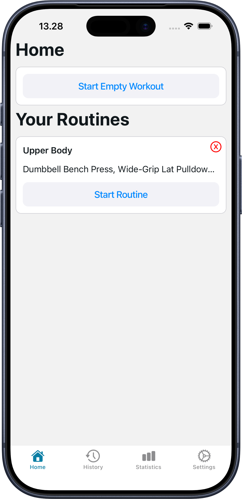
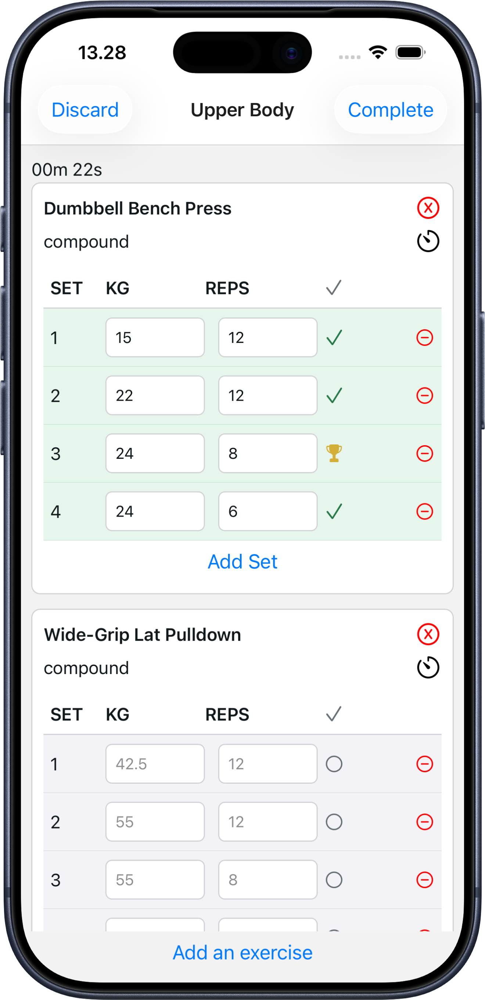
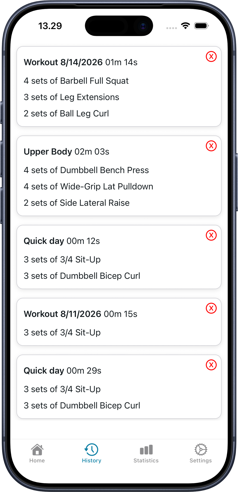

# Workout Tracker App

An iOS-first workout tracker built with React Native and Expo. Create reusable routines, log workouts set by set, and keep your training history stored locally on your device.

## Screenshots

|                                                Home and routines                                                |                                                   Active workout                                                    |                                      Workout history                                       |
| :-------------------------------------------------------------------------------------------------------------: | :-----------------------------------------------------------------------------------------------------------------: | :----------------------------------------------------------------------------------------: |
|  |  |  |

## Features

- Start an empty workout or build and reuse saved routines
- Search the exercise library and filter by strength, stretching, or cardio
- Track weight, repetitions, completed sets, and workout duration
- Add or remove exercises and sets while a workout is in progress
- Configure rest times and use the built-in rest timer
- Prefill sets from the most recent performance for each exercise
- Highlight new weight and repetition personal records
- Save completed workouts locally with SQLite
- Review, expand, and delete entries from workout history
- Review workout statistics and exercise progress charts
- Follow the device's light or dark color scheme

## Status

The app is currently focused on iOS and has not yet been tested on Android.

## Run locally

### Prerequisites

- Node.js and npm
- Xcode with an iOS Simulator

### Install and start

```bash
npm install
npm run ios
```

Other available commands:

```bash
npm run start
npm run android
npm run web
```

## Built with

- React Native and Expo
- Expo Router
- Expo SQLite
- TanStack Query
- TypeScript
